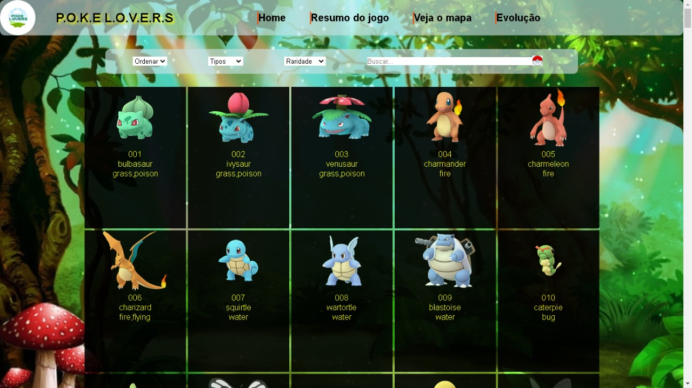
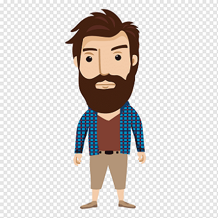
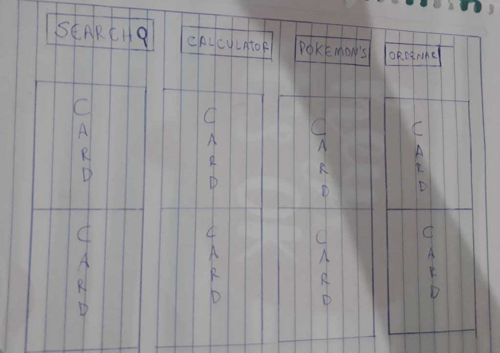
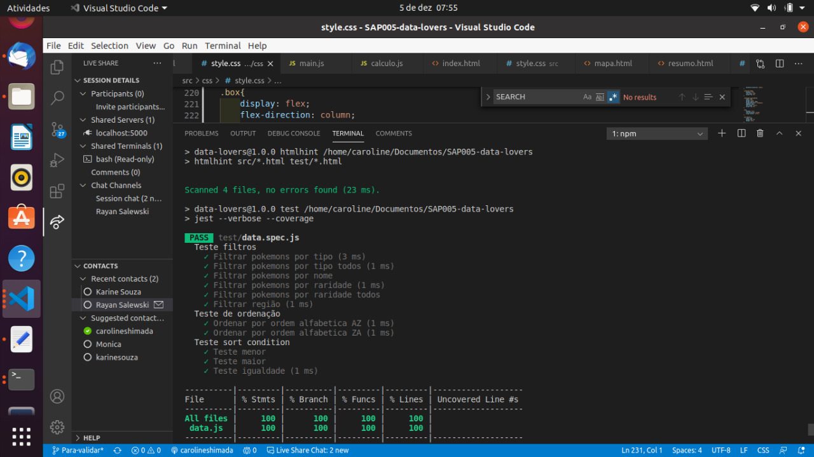

# PokeLovers 💛

## Índice

* [1. Resumo do projeto](#1-resumo-do-projeto)
* [2. Definição de Persona](#2-definição-de-Persona)
* [3. Histórias de usuários](#3-Histórias-de-Usuários)
* [4. Protótipo de baixa fidelidade](#4-Protótipo-de-baixa-fidelidade)
* [5. Teste](#5-Teste)

***

## 1. Resumo do Projeto

PokeLovers é uma página que contém informações dos pokémons da região de Kanto e Johto. Nela o usuário pode visualizar todos os cards com os pokémons na tela, ordená-los por ordem alfabética, filtrar sua busca por tipo e por raridade e pesquisar por nome o pokémon que deseja consultar. Além disso, na página o usuário consegue visualizar o mapa das regiões de Kanto e Johto, ler um resumo do jogo Pokémon GO e fazer um cálculo para saber quantos pokémons ainda faltam de cada região. 

## 2. Definição de Persona

Para validar nossa persona e criarmos as histórias de usuários, elaboramos um formulário com algumas perguntas e enviamos para que alguns usuários respondessem.

## Persona

 Gustavo, 28 anos, morador da cidade de São Paulo. É formado em contabilidade e trabalha em um renomado escritório no centro da cidade. Nas horas vagas curte ouvir música, sair e beber com os amigos, assistir series, animes e jogar videogame. Possui o Pokémon Go em seu celular e joga quase todos os dias. Gustavo se preocupa muito com a qauntidade que possui de Pokémon’s e acredita que seria interessante ter uma página que mostrasse o quanto falta para completar sua lista de Pokémon's.
Com base nas informações coletadas, escrevemos algumas histórias de usuários.

## 3. Histórias de usuários

•	"Eu como usuário, gostaria de poder calcular quantos Pokémons faltam para completar minha lista de cada região"

•	"Eu como usuário gostaria de visualizar as informações sobre cada Pokémon em um Card.

•	"Eu como usuário preciso de um campo onde posso pesquisar o nome do Pokémon sem ter que ficar rolando a página para acha-lo."

•	"Eu como usuário gostaria de filtrar os Pokémon’s pelo tipo de cada um deles."

•	"Eu como usuário acho interessante ter uma página que contenha informações sobre raridade, CP, HP, fraquezas e evolução de cada Pokémon."

## 4. Protótipo de baixa fidelidade

## 5. Teste

💻🙎
Projeto realizado por Caroline Shimada e Karine Venerando.
